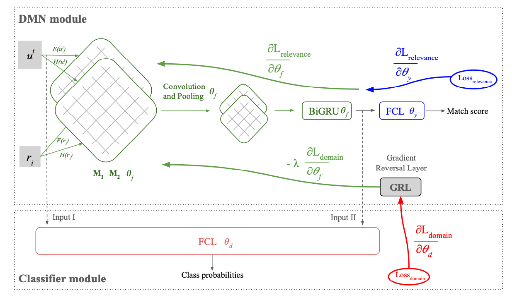

# Domain Adaptation for Conversation Response Ranking

This repo contains the implementation of two regularization techniques for Deep Matching Networks, built on top of the code from https://github.com/yangliuy/NeuralResponseRanking. We added a parameter to employ either Domain Adversarial Learning (DAL) to induce domain-agnostic representations, or to apply multi-task learning for domain classification (MTL) inducing domain-aware representations. We modified the .config files to receive extra inputs such as the out-of-domain prediction set.

